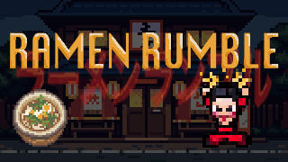
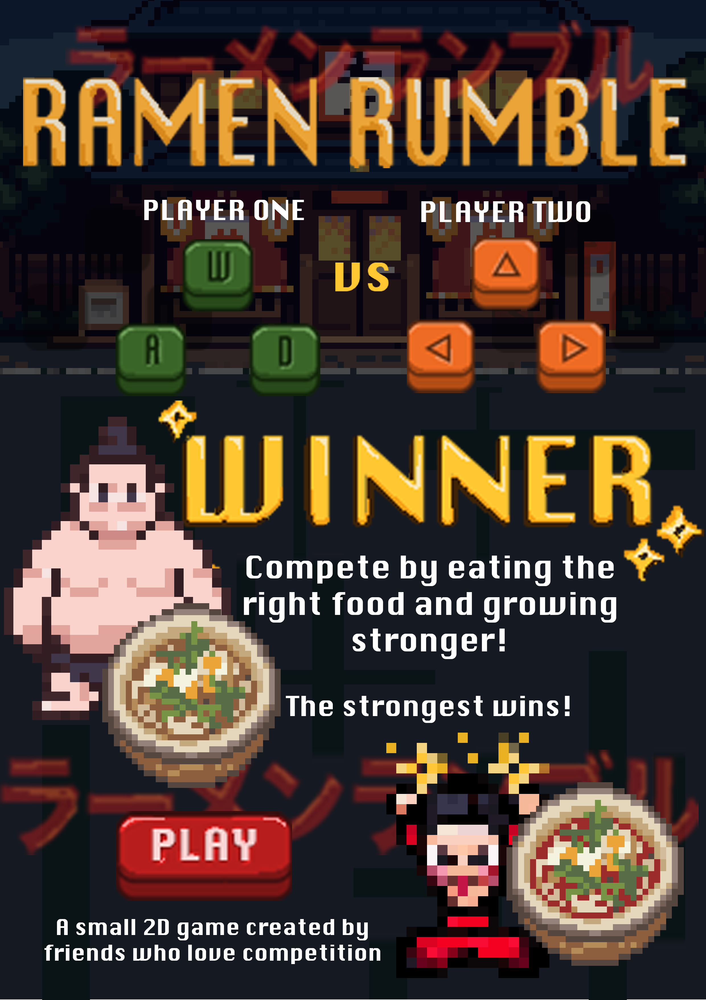

  

## 🎮 RAMEN RUMBLE
Et raskt reaksjonsbasert spill der to sumobrytere konkurrerer om å spise seg størst før kampen. Velg riktig mat i høyt tempo. God mat gjør deg større, dårlig mat og spicy forsinker deg, størst vinner!!

## 🕹️ Slik spiller du
WASD for spiller 1 (venstre) og Piltaster for spiller 2 (høyre)

## 🚀 Om spillet
Du styrer en sumobryter som må reagere raskt på tallerkener med mat — spis det som gjør deg større, og send bort det som gjør deg svak eller treg.

Målet er å vokse mest mulig før kampen starter og bli størst i ringen.

Spillet passer jam-temaet *Growth* ved at hele progresjonen handler om fysisk vekst: jo bedre valg og reaksjonstid, desto større blir karakteren.

## 📦 Hvordan kjøre
Krever Python + pygame. 
git clone https://github.com/dscoury/GameJam2026.git
Kjør `python main.py` i terminal.

## 👥 Team 
- Christian 
- Dylan
- Linn
- Sondre
  

## ⏱️ Laget på

🕒 50 timer  
🎯 Jam: IFI - GameJam 2026

  

